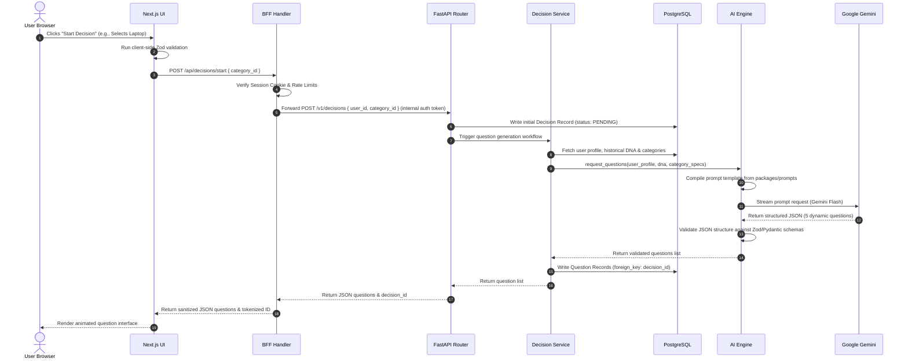
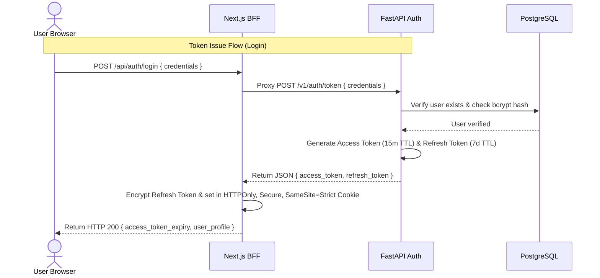
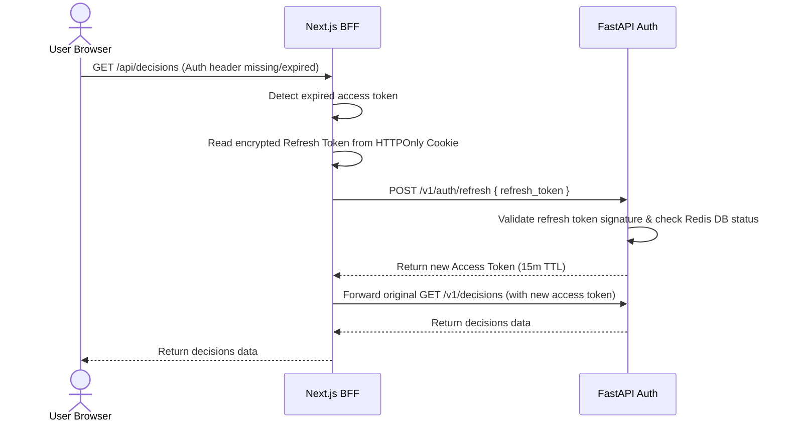
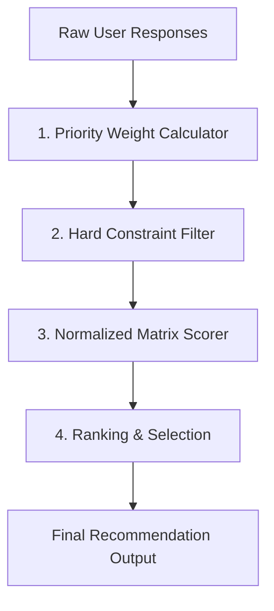
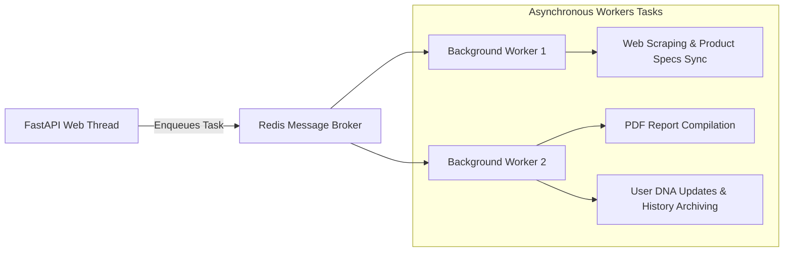

# Nexus — Production System Architecture

This document defines the production system architecture for **Nexus**, the AI-powered decision engine. It outlines the data structures, integration pipelines, API specs, and quality frameworks necessary for a world-class platform capable of scaling to millions of users.

---

## 1. High-Level System Architecture

Nexus is built as a highly decoupled, polyglot monorepo. It features a Next.js 15 App Router frontend and a FastAPI (Python) backend to balance UI responsiveness with high-performance mathematical computation and AI orchestration.

```mermaid
graph TD
    User([User Browser / Client])
    
    subgraph Frontend [Next.js Monorepo Workspace]
        Web[Next.js App Router UI]
        BFF[Next.js BFF / Route Handlers]
    end
    
    subgraph Backend [FastAPI Application]
        API[FastAPI Router Layer]
        DE[Decision Engine Layer]
        AI[AI Orchestration Layer]
        Auth[Auth / JWT Layer]
    end
    
    subgraph Data [Storage & Caching]
        DB[(PostgreSQL / Supabase)]
        Cache[(Redis Cache)]
        S3[(Object Storage / S3)]
    end
    
    subgraph External [External Services]
        Gemini[Google Gemini API]
        Tavily[Tavily Search API]
        Analytics[PostHog / Mixpanel]
    end

    User <=>|HTTPS / WSS / SSE| Web
    Web <=>|Internal JS Calls| BFF
    BFF <=>|HTTP / Token Forwarding| API
    
    API <=>|JWT Verification| Auth
    API <=>|Execute Rules / Math| DE
    API <=>|Compile Prompts / Call LLM| AI
    
    AI <=>|Reasoning & Questions| Gemini
    AI <=>|Real-time Research| Tavily
    
    DE & AI & Auth <=>|Read / Write SQL| DB
    DE & AI & Auth <=>|Cache Sessions / Prompts| Cache
    DE <=>|Store PDFs / Reports| S3
    
    Web & API --->|Event Streams| Analytics
```

### Layer Responsibilities & Design Rationale

1. **Next.js Frontend (App Router)**: Focuses strictly on layout rendering, hydration, static page optimization, and UI interactions (using Zustand for UI state and Tailwind for typography/spacing).
2. **Next.js Route Handlers (BFF)**: Acts as the **Backend-for-Frontend (BFF)**. It secures cookie sessions, acts as a reverse proxy to FastAPI, rate-limits public requests, and sanitizes outgoing APIs to hide internal database IDs.
3. **FastAPI Backend**: Run-time typed layer handling business logic. Python is chosen here because it has first-class support for mathematical processing (scoring algorithms) and AI SDK integration.
4. **Decision Engine**: A deterministic mathematical computation layer that computes multi-criteria weights, runs constraint filters, and outputs normalized score comparisons.
5. **AI Orchestration Layer**: Manages prompt templates, compiles user contexts from the database, runs the safety filter, triggers Gemini API streaming channels, and validates JSON structural integrity.
6. **Data & Storage Layer**:
   - **PostgreSQL**: Serves as the relational ledger for users, session parameters, specs, and history.
   - **Redis**: Resolves fast key-value lookups (sessions, lock mutexes, rate limiting, and prompt compilation caching).
   - **Object Storage (S3)**: Houses static PDF reports and OG image assets.

---

## 2. Request Flow Lifecycle

The following lifecycle diagram shows a complete round-trip request when a user initializes a decision:



---

## 3. Authentication Architecture

Authentication is stateless, utilizing cryptographically signed JSON Web Tokens (JWT) with Secure Cookies.



### Access Token Refresh Flow



* **Session Validation & Route Protection**:
  - **Protected Routes (`(app)/*`)**: Next.js middleware intercepts requests, extracts the cookies, and runs verification. If invalid or missing, it triggers the refresh flow or redirects to `/login`.
  - **Share Links (`/share/[id]`)**: Decoupled from session checks. They execute read-only DB requests using UUID lookups, returning anonymous static metadata.

---

## 4. Database Architecture (12 Tables)

We utilize PostgreSQL (via Supabase) with Row-Level Security (RLS) enabled. 

```
┌──────────────────────────────────────────────────────────────────────────────────┐
│                               DATABASE SCHEMA MAP                                │
└──────────────────────────────────────────────────────────────────────────────────┘
    Users ───1:N─── Decisions ───1:N─── Questions ───1:N─── Answers
                       │
                       ├───1:N─── Recommendations
                       ├───1:N─── Decision History
                       └───1:1─── Memory
    
    Products ───1:N─── (Product Specs / Pricing)
    Users ───1:1─── UserDecisionDNA
    Sessions
    FeatureFlags
    AuditLogs
```

### 1. `users`
* Columns:
  - `id`: `UUID` (PK, Default: `gen_random_uuid()`)
  - `email`: `VARCHAR(255)` (Unique, Indexed, Not Null)
  - `password_hash`: `VARCHAR(255)` (Not Null)
  - `created_at`: `TIMESTAMPTZ` (Not Null, Default: `now()`)
  - `updated_at`: `TIMESTAMPTZ` (Not Null, Default: `now()`)
* Constraints: Email format validation regex constraint.

### 2. `user_profiles`
* Columns:
  - `user_id`: `UUID` (PK, FK referencing `users.id` ON DELETE CASCADE)
  - `first_name`: `VARCHAR(100)`
  - `last_name`: `VARCHAR(100)`
  - `avatar_url`: `TEXT`
  - `preferences`: `JSONB` (Default: `'{}'`)

### 3. `decisions`
* Columns:
  - `id`: `UUID` (PK, Default: `gen_random_uuid()`)
  - `user_id`: `UUID` (FK referencing `users.id` ON DELETE CASCADE, Indexed, Not Null)
  - `category`: `VARCHAR(100)` (Not Null, Indexed) (e.g., "laptop", "career")
  - `status`: `VARCHAR(50)` (Not Null, Default: 'PENDING') (e.g. 'PENDING', 'QUESTIONING', 'ANALYZING', 'COMPLETE')
  - `title`: `VARCHAR(255)` (Not Null)
  - `created_at`: `TIMESTAMPTZ` (Not Null, Default: `now()`)
  - `updated_at`: `TIMESTAMPTZ` (Not Null, Default: `now()`)
* Indexes: Composite index `idx_user_category_date` on `(user_id, category, created_at DESC)`.

### 4. `questions`
* Columns:
  - `id`: `UUID` (PK)
  - `decision_id`: `UUID` (FK referencing `decisions.id` ON DELETE CASCADE, Indexed, Not Null)
  - `order_index`: `INT` (Not Null)
  - `question_text`: `TEXT` (Not Null)
  - `input_type`: `VARCHAR(50)` (Not Null) (e.g. 'single_choice', 'multi_choice', 'slider', 'budget_range')
  - `options`: `JSONB` (Nullable) (Stores list of selectable choices)
  - `weight_impact`: `JSONB` (Nullable) (Mapping of answers to criteria weights)

### 5. `answers`
* Columns:
  - `id`: `UUID` (PK)
  - `decision_id`: `UUID` (FK referencing `decisions.id` ON DELETE CASCADE, Not Null)
  - `question_id`: `UUID` (FK referencing `questions.id` ON DELETE RESTRICT, Unique within decision context, Not Null)
  - `selected_value`: `JSONB` (Not Null) (Raw value submitted by user)
  - `created_at`: `TIMESTAMPTZ` (Default: `now()`)
* Indexes: Unique index `idx_decision_question` on `(decision_id, question_id)`.

### 6. `recommendations`
* Columns:
  - `id`: `UUID` (PK)
  - `decision_id`: `UUID` (FK referencing `decisions.id` ON DELETE CASCADE, Unique, Not Null)
  - `verdict_product_id`: `UUID` (FK referencing `products.id` ON DELETE RESTRICT, Not Null)
  - `confidence_score`: `NUMERIC(5,2)` (Not Null) (e.g., 94.50)
  - `structured_analysis`: `JSONB` (Not Null) (Holds pros, cons, speculative alternatives, specifications mapping)
  - `explanation_md`: `TEXT` (Not Null)
  - `created_at`: `TIMESTAMPTZ` (Default: `now()`)

### 7. `products`
* Columns:
  - `id`: `UUID` (PK)
  - `sku`: `VARCHAR(100)` (Unique, Indexed, Not Null)
  - `name`: `VARCHAR(255)` (Not Null)
  - `category`: `VARCHAR(100)` (Not Null, Indexed)
  - `specs`: `JSONB` (Not Null, Default: `'{}'`) (Normalized specifications keys)
  - `price_usd`: `NUMERIC(10,2)` (Not Null)
  - `is_active`: `BOOLEAN` (Default: `true`)
* Indexes: GIN index `idx_products_specs` on `specs` for fast JSON spec lookups.

### 8. `user_decision_dna`
* Columns:
  - `user_id`: `UUID` (PK, FK referencing `users.id` ON DELETE CASCADE)
  - `traits`: `JSONB` (Not Null) (e.g., `{"risk_tolerance": 0.8, "brand_loyalty_apple": 0.9}`)
  - `last_calculated`: `TIMESTAMPTZ` (Not Null)

### 9. `decision_memory`
* Columns:
  - `id`: `UUID` (PK)
  - `user_id`: `UUID` (FK referencing `users.id` ON DELETE CASCADE, Not Null)
  - `domain_key`: `VARCHAR(100)` (Not Null) (e.g. "preferred_screen_size", "blacklisted_brands")
  - `domain_value`: `JSONB` (Not Null)
  - `confidence`: `NUMERIC(3,2)` (Not Null, Default: 1.00)
  - `updated_at`: `TIMESTAMPTZ` (Default: `now()`)
* Indexes: Unique index `idx_user_domain_key` on `(user_id, domain_key)`.

### 10. `recommendation_versions`
* Columns:
  - `id`: `UUID` (PK)
  - `recommendation_id`: `UUID` (FK referencing `recommendations.id` ON DELETE CASCADE, Not Null)
  - `version_index`: `INT` (Not Null)
  - `trigger_reason`: `VARCHAR(255)` (Not Null) (e.g., "priority_change", "price_drop")
  - `verdict_product_id`: `UUID` (FK referencing `products.id` ON DELETE RESTRICT, Not Null)
  - `confidence_score`: `NUMERIC(5,2)` (Not Null)
  - `delta_analysis`: `JSONB` (Not Null)
  - `created_at`: `TIMESTAMPTZ` (Default: `now()`)

### 11. `sessions`
* Columns:
  - `id`: `UUID` (PK)
  - `user_id`: `UUID` (FK referencing `users.id` ON DELETE CASCADE, Not Null)
  - `refresh_token_hash`: `VARCHAR(255)` (Not Null)
  - `user_agent`: `TEXT`
  - `ip_address`: `VARCHAR(45)`
  - `expires_at`: `TIMESTAMPTZ` (Not Null)
  - `is_revoked`: `BOOLEAN` (Default: `false`)

### 12. `audit_logs`
* Columns:
  - `id`: `BIGSERIAL` (PK)
  - `user_id`: `UUID` (FK referencing `users.id` ON DELETE SET NULL, Nullable for public/anonymous users)
  - `event_type`: `VARCHAR(100)` (Not Null, Indexed)
  - `description`: `TEXT` (Not Null)
  - `ip_address`: `VARCHAR(45)`
  - `payload`: `JSONB`
  - `created_at`: `TIMESTAMPTZ` (Default: `now()`)

---

## 5. API Architecture SPEC

### 1. Start Decision Process
* **Endpoint**: `POST /api/decisions`
* **Purpose**: Creates a new decision record and generates initial questions.
* **Authentication**: Required (JWT Bearer Token or Session Cookie).
* **Request Header**: `Authorization: Bearer <token>`
* **Request Body**:
  ```json
  {
    "category": "laptop",
    "title": "Buying my college laptop"
  }
  ```
* **Response (HTTP 201 Created)**:
  ```json
  {
    "decision_id": "0d6118d5-ee80-4581-8b29-c0975611cbaf",
    "questions": [
      {
        "id": "e93fca1e-a4b5-4bfe-bb34-118cb9cf7bca",
        "order_index": 1,
        "question_text": "What is your budget range?",
        "input_type": "budget_range",
        "options": { "min": 500, "max": 4000, "currency": "USD" }
      }
    ]
  }
  ```
* **Validation**: `category` must be an approved enum value, `title` length must be between $3$ and $100$ characters.
* **Errors**: 
  - `400 Bad Request` (Invalid payload format).
  - `401 Unauthorized` (Token expired or missing).
  - `429 Too Many Requests` (Rate limit exceeded).

### 2. Submit Answers
* **Endpoint**: `POST /api/decisions/{id}/answers`
* **Purpose**: Submits answers for a decision session to transition state.
* **Authentication**: Required.
* **Request Body**:
  ```json
  {
    "answers": [
      {
        "question_id": "e93fca1e-a4b5-4bfe-bb34-118cb9cf7bca",
        "selected_value": { "min": 1000, "max": 1500 }
      }
    ]
  }
  ```
* **Response (HTTP 200 OK)**:
  ```json
  {
    "status": "ANALYZING",
    "message": "Answers received. Recommendation computation triggered."
  }
  ```
* **Validation**: All `question_id` values must correspond to the specified `decision_id` and have valid response formats matching their respective `input_type` definitions.

### 3. Stream Recommendation (SSE)
* **Endpoint**: `GET /api/decisions/{id}/recommendation/stream`
* **Purpose**: Streams the multi-step AI reasoning and recommendation verdict via Server-Sent Events (SSE).
* **Authentication**: Required.
* **Response Content-Type**: `text/event-stream`
* **Stream Events**:
  1. `event: stages` - `data: {"stage": "RESEARCHING", "detail": "Scanning latest specs..."}`
  2. `event: stages` - `data: {"stage": "FILTERING", "detail": "Eliminating options over budget..."}`
  3. `event: reasoning` - `data: "To fit your requirement of graphic design..."` (Tokens stream)
  4. `event: result` - `data: {"verdict_product_id": "product-uuid", "confidence_score": 94.5}`
  5. `event: done` - Connection closed.

### 4. Fetch History
* **Endpoint**: `GET /api/decisions`
* **Purpose**: Retrieves a paginated list of user's past decisions.
* **Authentication**: Required.
* **Response (HTTP 200 OK)**:
  ```json
  {
    "decisions": [
      {
        "id": "uuid",
        "title": "College Laptop",
        "category": "laptop",
        "status": "COMPLETE",
        "created_at": "2026-06-22T06:00:00Z"
      }
    ],
    "pagination": { "next_cursor": "base64-string", "has_more": false }
  }
  ```

### 5. Fetch Shared Report (Public)
* **Endpoint**: `GET /api/share/{id}`
* **Purpose**: Fetches the public recommendation report view.
* **Authentication**: None (Anonymous Route).
* **Response (HTTP 200 OK)**: Returns anonymous metadata, explanation text, and product specifics. Identifiable user identifiers are omitted.

---

## 6. AI Orchestration Architecture (Gemini Engine)

The AI Engine acts as a structured reasoning compiler. Rather than running open-ended chats, it operates in strict, deterministic steps:

```
[User Answers] ──► [Prompt Builder] ──► [Google Gemini (JSON Mode)] ──► [Pydantic Validation] ──► [DB Write]
                        ▲
                        │
                [Context Compiler]
           (Memory, Product Specs, DNA)
```

1. **Context Compiler**: Gathers parameters before calling the LLM. It aggregates the user's decision context:
   - Dynamic user profile traits from `user_decision_dna` (e.g. `prefers_apple: true`).
   - Relevant user preferences retrieved from `decision_memory` (e.g. `dislikes_heavy_laptops: true`).
   - Standard specs and benchmark logs from the local database.
2. **Prompt Builder**: Formats the prompt using YAML templates from `packages/prompts`. It injects the context variables, system guidelines, and output constraints.
3. **Structured Outputs (JSON Mode)**: Instructs Gemini to respond using structured JSON output. We define the schema in Python using Pydantic:
   ```python
   class RecommendationSchema(BaseModel):
       recommended_product_sku: str
       confidence_score: float
       pros: List[str]
       cons: List[str]
       tradeoffs: Dict[str, str]
   ```
4. **Validation & Fallback**:
   - If the JSON parser fails or the schema validation fails, the system executes an automatic retry request, passing the validation exception back to Gemini to get a corrected structure.
   - If the retry fails, the system falls back to a deterministic backup solver (using the Decision Engine's matrix calculations) and logs the failure to Sentry.
5. **Token Management & Cost Tracking**:
   - Compiles token count logs for each call to track expenses.
   - Fallback routing: Large reasoning steps use Gemini Pro, while quick question compilation and simple parsers route to Gemini Flash to control API costs.

---

## 7. Decision Engine Architecture

The Decision Engine calculates recommendations using deterministic algorithms to prevent LLM hallucinations:



### Core Pipeline Components

1. **Priority Weight Calculator**:
   - Takes priority slider responses (e.g. Performance: 5/5, Portability: 2/5) and computes normalized weights using a multi-criteria decision analysis algorithm.
   - All weights sum to $1.0$.
2. **Hard Constraint Filter**:
   - Runs deterministic SQL and JSON queries to eliminate products that do not meet strict user criteria (e.g. if the user selects a budget limit of $1500$, all products with `price_usd > 1500` are instantly filtered out).
3. **Normalized Matrix Scorer**:
   - Maps remaining products against specifications, computing utility scores for each property.
   - Real-world specifications (like RAM, storage size, and weight) are normalized to a value between $0.0$ and $1.0$.
   - The final score is computed as the dot product of the normalized specifications vector and the priority weights vector:
     $$\text{Score}(P) = \sum_{i=1}^{n} (W_i \times S_{pi})$$
4. **Confidence Calculator**:
   - Measures matching coverage across three areas:
     - **Data Quality**: Is product specifications data complete?
     - **Requirement Match**: Do the specs meet the user's desired priorities?
     - **Market Coverage**: Are there enough competing alternatives evaluated in this category?

---

## 8. Redis Usage & Caching Strategy

We use Redis for low-latency lookups, scheduling, and rate limiting:

| Key Namespace | Data Structure | TTL | Purpose |
|---|---|---|---|
| `auth:session:{user_id}:{session_id}` | `String` | 7 Days | Houses encrypted active session metadata. |
| `rate:ip:{ip_address}` | `String` | 1 Minute | Implements sliding-window API rate limits. |
| `cache:prompt:{template_hash}` | `String` | 24 Hours | Cachescompiled prompt templates to avoid redundant filesystem reads. |
| `cache:products:{category}` | `String` | 1 Hour | Caches product specification listings to reduce database queries. |
| `sse:channel:{decision_id}` | `PubSub` | 10 Minutes | Manages Server-Sent Event stream buffers for concurrent users. |
| `feature_flags` | `Hash` | Indefinite | Caches project feature flag configurations to allow instant global toggling. |

---

## 9. Background Jobs Architecture

To keep the main API thread fast and responsive, time-consuming operations are offloaded to background workers using Celery or a Redis-backed queue system:



1. **Queues**:
   - `high-priority`: Handles short tasks (such as sending user transactional emails or updating cached feature flags).
   - `default`: Handles general tasks (such as generating PDF reports or updating `user_decision_dna` parameters).
   - `scraping`: Runs long-running web scrapers to gather product specs and pricing data.
2. **Workers**:
   - Run in separate, isolated containers, keeping memory usage clean.
   - Long operations (such as compiling PDF reports using headless printing tools) run in the background, updating the database status once complete.

---

## 10. Security Architecture

1. **Rate Limiting**:
   - Handled via `slowapi` in FastAPI and custom middleware in Next.js.
   - Public route limit: Maximum $60$ requests per minute per IP.
   - AI generation route limit: Maximum $5$ execution calls per minute per user.
2. **CORS and Headers**:
   - CORS is restricted to the specific frontend web domain.
   - Enforces strict security headers:
     - `Content-Security-Policy (CSP)` (Restricts scripts to verified origins).
     - `X-Frame-Options: DENY` (Prevents clickjacking attacks).
     - `Strict-Transport-Security (HSTS)` (Forces SSL connections).
3. **Prompt Injection Protection**:
   - Inputs are sanitized using safety filters to strip prompt injection characters (like `Ignore previous instructions`).
   - The system checks if input lengths exceed maximum token budgets, preventing buffer exhaustion attacks.
4. **Data Encryption**:
   - Sensitive user identifiers and database tokens are encrypted at rest using AES-256 GCM.

---

## 11. Error Handling

We implement a unified error handling system to map server exceptions to clean, user-friendly responses:

```typescript
// Shared API Error Response Structure
interface APIErrorResponse {
  error: {
    code: string;         // e.g. "DECISION_NOT_FOUND"
    message: string;      // User-friendly description
    request_id: string;   // Trace UUID for support logs
    details?: any;        // Validation error diagnostics
  }
}
```

* **Backend global exceptions**:
  - Unhandled exceptions are caught by a global middleware wrapper. It logs the stack trace with the active `request_id` to Sentry and returns an `HTTP 500` error with a generic, non-leaking message.
  - Validation failures (e.g. incorrect Pydantic body parameters) return an `HTTP 422 Unprocessable Entity` error, mapping exactly which fields failed validation.
* **Frontend boundaries**:
  - Route handlers check the error code structure. If they receive a `401 Unauthorized` error, they automatically trigger a token refresh flow.
  - For `404` or server connection issues, the frontend displays an interactive error page featuring diagnostic reference numbers to assist user support teams.

---

## 12. Monitoring & Observability

We use OpenTelemetry and Prometheus to track application health:

* **OpenTelemetry (OTel)**:
  - Generates trace records across our services. A single `request_id` spans from the initial Next.js BFF call through to downstream FastAPI controllers and database queries.
* **Prometheus Metrics**:
  - Exposes key application performance metrics:
    - `nexus_http_requests_total{method, status, path}`: Tracks API request counts.
    - `nexus_llm_generation_latency_seconds{model}`: Tracks Gemini API latency.
    - `nexus_db_query_duration_seconds{query}`: Tracks database execution times.
* **Alerting**:
  - Sentry is configured to alert the engineering team if the API error rate exceeds $1\%$ of traffic in a 5-minute window or if average LLM streaming latency rises above $3$ seconds.

---

## 13. Performance Targets

To deliver a premium, responsive experience, the platform must meet the following performance targets under load:

| Metric | Target | Rationale |
|---|---|---|
| **Lighthouse Performance** | $\ge 95$ | Core user experience standard. |
| **TTFB (Time to First Byte)** | $< 100\text{ms}$ | Rapid HTML delivery. |
| **CLS (Cumulative Layout Shift)**| $< 0.05$ | Smooth transitions without layout jumps. |
| **BFF Metadata Latency** | $< 80\text{ms}$ | Fast loading of configuration data. |
| **Database Read Latency** | $< 15\text{ms}$ | Efficient PostgreSQL indexing. |
| **AI Stream TTFB** | $< 800\text{ms}$ | Instant feedback when generating recommendations. |
| **Next.js Bundle Size** | $< 120\text{KB}$ | Small bundle size for rapid initial load. |

---

## 14. Scalability Strategy

The platform scales dynamically as user demand grows:

```
               [ 100 to 1,000 Users ]
       FastAPI + PostgreSQL Single Container Stack
                         │
                         ▼
             [ 1,000 to 10,000 Users ]
Horizontal Web/API Scaling & Redis Session Cache Enabled
                         │
                         ▼
            [ 10,000 to 100,000 Users ]
      Read-Replicas added to PostgreSQL DB Layer
                         │
                         ▼
               [ 100,000+ Users ]
Celery Workers offload heavy computations; CDN Caches Reports
```

1. **10,000 to 100,000 Users**:
   - Implements read replicas for PostgreSQL. Write queries are routed to the primary DB instance, while read requests (like viewing decisions history or retrieving product specs) execute against read-only replicas.
2. **100,000+ Users**:
   - Integrates background workers (Celery/Redis) to handle heavy tasks (PDF generation, web scraping, email delivery) asynchronously.
   - Public shared reports are cached at edge CDNs (Cloudflare), completely bypassing the database for shared views.
3. **Database Partitioning**:
   - When the `audit_logs` and `answers` tables exceed $50\text{ million}$ records, they are partitioned by `created_at` date ranges to keep index sizes small and queries fast.

---

## 15. Dependency Rules

We enforce strict dependency boundaries using ESLint and boundary plugins to prevent spaghetti code:

```
                  ┌──────────────────────┐
                  │   apps/web & apps/api│
                  └──────────────────────┘
                              │
                              ▼
                  ┌──────────────────────┐
                  │      packages/*      │
                  └──────────────────────┘
                              │
                              ▼
                  ┌──────────────────────┐
                  │      tooling/*       │
                  └──────────────────────┘
```

* **Allowed Dependencies**:
  - `apps/*` can import from `packages/*` and `tooling/*`.
  - `packages/*` can import from `tooling/*` and other shared packages (if registered in `pnpm-workspace.yaml`).
* **Forbidden Dependencies**:
  - **No packages $\rightarrow$ apps imports**: Shared packages must never import code or configuration from applications.
  - **No UI $\rightarrow$ database imports**: The frontend cannot import database schemas, repositories, or models directly.
  - **No database connections in UI**: The Next.js frontend cannot connect directly to PostgreSQL. It must communicate with the database via the API layer.

***

Approved by:
- **Lead System Architect**
- **Lead Security Architect**
