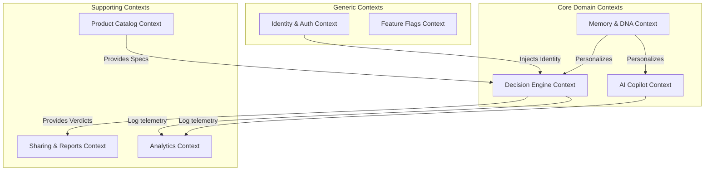
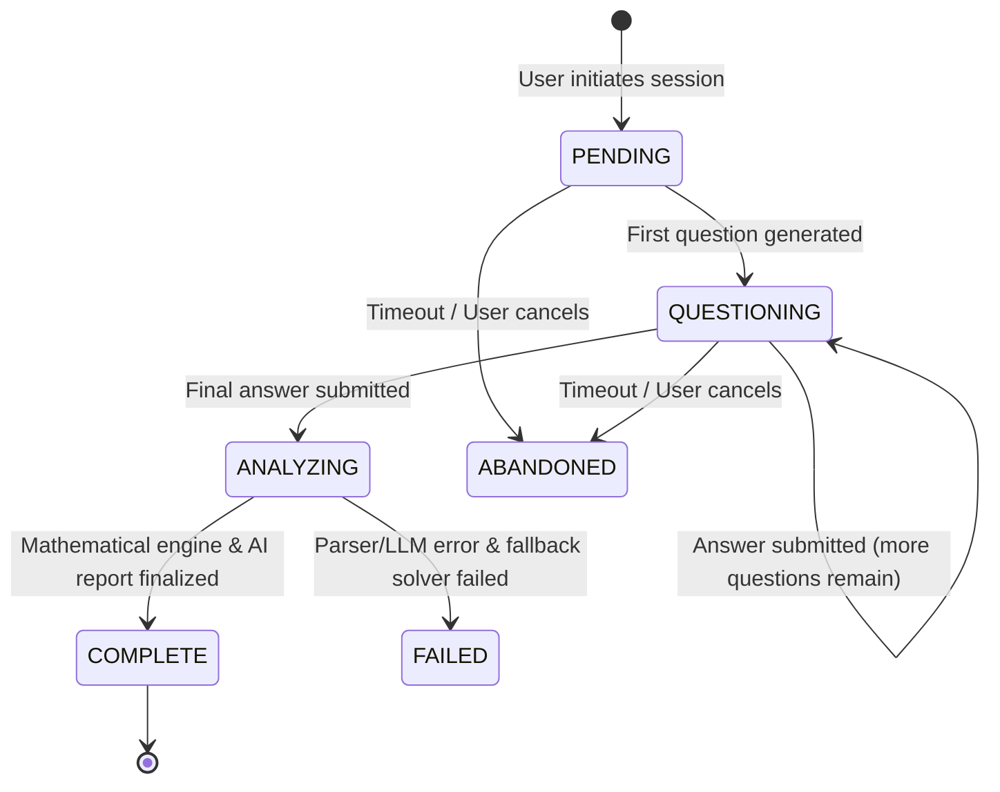
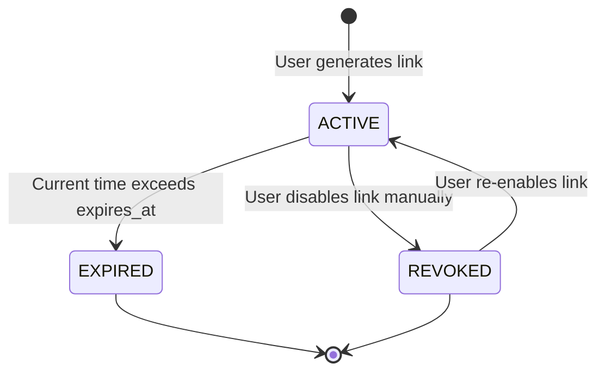

# Nexus — Domain-Driven Design (DDD) & Business Architecture

This document serves as the single source of truth for the business architecture, logical domain model, and ubiquitous language of the Nexus AI Decision Engine.

---

## 1. Core Domain

### Problem Space
Modern consumers and professionals suffer from **choice fatigue** and **purchase regret**. The internet provides abundant data but fails to provide structured, objective decision support. General LLM chatbots lack mathematical consistency and suffer from hallucinations. Product catalogs lack personalized context, while scoring templates are rigid. Nexus bridges this gap by combining deterministic mathematical multi-criteria decision analysis (MCDA) with generative AI reasoning.

### Business Goals
* **Objective Trust**: Deliver mathematically provable recommendations based on user-defined priority weights.
* **Effortless Discovery**: Gather requirements using dynamic, context-aware questioning.
* **Actionable Clarity**: Summarize trade-offs, confidence levels, and specs comparisons cleanly.
* **Ecosystem Longevity**: Build user Decision DNA to refine future recommendations.

### Domain Boundaries
* **Core Domain**: Requirement matching, MCDA prioritization scoring, reasoning compilation, and decision memory tracking.
* **Supporting Subdomains**: Product catalog data normalization, public link sharing, and behavioral telemetry.
* **Generic Subdomains**: User identity authorization, transactional notifications, and system audit logging.

### Ubiquitous Language
* **Decision**: A structured process initiated by a User to select a Product within a specific Category.
* **Verdict**: The top-ranked recommended product returned at the end of a Decision process.
* **Criterion**: A specific specification or feature (e.g., "weight", "RAM", "battery_life") used to evaluate products.
* **Priority Weight**: A user-defined coefficient representing the relative importance of a specific Criterion (sum of all weights must equal $1.0$).
* **Decision DNA**: The user's long-term behavioral profile, which compiles their core preferences and priorities over time.
* **Memory**: Short-term and long-term user preferences (such as blacklisted brands or specific screen requirements) that persist across sessions.

---

## 2. Bounded Contexts

We map the system boundaries to isolate specific business domains:



1. **Identity & Auth Context**: Manages user registers, passwords, secure JWT access tokens, and device sessions.
2. **Decision Engine Context**: Orchestrates structural calculations, checks hard constraint rules, runs specification scoring matrices, and outputs product rankings.
3. **AI Copilot Context**: Resolves interactive dynamic questioning, compiles prompt contexts, calls the LLM, and formats conversational feedback.
4. **Memory & DNA Context**: Manages preferences over time, maps behavioral personas, and aggregates data to update Decision DNA.
5. **Product Catalog Context**: Stores specs lists, updates pricing info, and exposes normalized product structures to the scoring engine.
6. **Sharing & Reports Context**: Exports static, anonymous decision reports, compiles PDF records, and handles public share links.
7. **Analytics Context**: Tracks active session metrics and stores system audit logs.

---

## 3. Domain Entities

### 1. `Decision`
* **Purpose**: Represents the lifecycle of a user's single decision process.
* **Attributes**: `id` (UUID), `user_id` (UUID), `category` (String), `title` (String), `status` (Enum), `created_at` (DateTime).
* **Business Rules**: Must belong to an active user. Cannot have status updated to `COMPLETE` without a linked `Recommendation`.
* **Lifecycle**: `PENDING` $\rightarrow$ `QUESTIONING` $\rightarrow$ `ANALYZING` $\rightarrow$ `COMPLETE` / `ABANDONED`.

### 2. `Question`
* **Purpose**: A requirement-gathering query generated dynamically based on the decision category and user DNA.
* **Attributes**: `id` (UUID), `decision_id` (UUID), `order_index` (Integer), `question_text` (String), `input_type` (Enum), `options` (JSON).
* **Business Rules**: Order index must be sequential. Option values must match the designated input type.

### 3. `Answer`
* **Purpose**: The user's response to a specific question.
* **Attributes**: `id` (UUID), `question_id` (UUID), `decision_id` (UUID), `selected_value` (JSON), `created_at` (DateTime).
* **Business Rules**: Only one answer per question per decision session. Once written, cannot be modified without invalidating subsequent questions.

### 4. `Recommendation`
* **Purpose**: The mathematical and logical output of the decision process.
* **Attributes**: `id` (UUID), `decision_id` (UUID), `verdict_product_id` (UUID), `confidence_score` (ValueObject), `structured_analysis` (JSON), `explanation_md` (String).
* **Business Rules**: Verdict must match one of the active catalog products. Confidence score must fall between $0.0$ and $100.0$.

### 5. `Product`
* **Purpose**: A candidate choice evaluated during the decision process.
* **Attributes**: `id` (UUID), `sku` (String), `name` (String), `category` (String), `specs` (JSON), `price_usd` (ValueObject), `is_active` (Boolean).
* **Business Rules**: Must have a unique SKU. Must include normalized values for all required category criteria.

### 6. `ShareLink`
* **Purpose**: A public link to a decision report, viewable by anonymous visitors.
* **Attributes**: `id` (UUID), `decision_id` (UUID), `token` (String), `expires_at` (DateTime), `is_active` (Boolean).
* **Business Rules**: Token must be cryptographically signed. If expired, access must be blocked.

---

## 4. Value Objects

Value Objects are immutable data classes defined by their attributes. They contain no identity keys:

1. **`Money`**:
   - *Attributes*: `amount` (Decimal), `currency` (String).
   - *Validation*: Amount cannot be negative. Currency must be an ISO 4217 standard string.
2. **`Score`**:
   - *Attributes*: `value` (Decimal).
   - *Validation*: Must fall within the range $[0.0, 1.0]$.
3. **`ConfidenceScore`**:
   - *Attributes*: `score` (Decimal), `label` (Enum: `HIGH`, `MEDIUM`, `LOW`).
   - *Validation*: Value must be between $0.0$ and $100.0$.
4. **`DecisionWeight`**:
   - *Attributes*: `criterion` (String), `weight_value` (Decimal).
   - *Validation*: Value must be between $0.0$ and $1.0$.
5. **`TimeRange`**:
   - *Attributes*: `start_time` (DateTime), `end_time` (DateTime).
   - *Validation*: Start time must precede end time.

---

## 5. Aggregates & Consistency Boundaries

To maintain data consistency across transactions, we group entities into Aggregates governed by Aggregate Roots:

```
┌────────────────────────────────────────────────────────────────────────┐
│                          DECISION AGGREGATE                            │
│                                                                        │
│                       [Decision] (Aggregate Root)                      │
│                           │                                            │
│                           ├───1:N─── [Question]                        │
│                           ├───1:N─── [Answer]                          │
│                           └───1:1─── [Recommendation]                  │
└────────────────────────────────────────────────────────────────────────┘

┌────────────────────────────────────────────────────────────────────────┐
│                        USER PREFERENCE AGGREGATE                       │
│                                                                        │
│                          [User] (Aggregate Root)                       │
│                           │                                            │
│                           ├───1:1─── [UserDecisionDNA]                 │
│                           └───1:N─── [DecisionMemory]                  │
└────────────────────────────────────────────────────────────────────────┘
```

1. **Decision Aggregate**:
   - **Root**: `Decision`.
   - **Boundary**: Contains the parent `Decision`, nested `Questions` generated for it, `Answers` submitted by the user, and the final output `Recommendation`.
   - **Consistency Rule**: Adding or changing an `Answer` must trigger a recalculation event that invalidates the existing `Recommendation` state, keeping the aggregate output consistent.
2. **User Preference Aggregate**:
   - **Root**: `User`.
   - **Boundary**: Contains `User`, `UserDecisionDNA`, and `DecisionMemory` records.
   - **Consistency Rule**: Updating decision DNA metrics must trigger a corresponding validation check across memory preferences to prevent conflicting rules.

---

## 6. Domain Services

Domain Services coordinate actions across multiple aggregates:

1. **Decision Service**:
   - *Responsibility*: Manages decision creation and tracks session progression.
2. **Recommendation Service**:
   - *Responsibility*: Coordinates the decision engine pipeline. It filters candidate products, executes matrix scoring, and triggers AI explanation compilation.
3. **Scoring Service**:
   - *Responsibility*: Runs the mathematical scoring formulas on normalized product specification values.
4. **Memory Service**:
   - *Responsibility*: Extracts preferences from answers and updates user profiles.

---

## 7. Domain Events

Domain Events publish state transitions asynchronously:

1. **`DecisionStarted`**:
   - *Trigger*: User initializes a decision.
   - *Payload*: `decision_id`, `user_id`, `category`, `timestamp`.
2. **`QuestionAnswered`**:
   - *Trigger*: User submits an answer.
   - *Payload*: `decision_id`, `question_id`, `answer_value`.
3. **`DecisionCompleted`**:
   - *Trigger*: Verdict is finalized.
   - *Payload*: `decision_id`, `verdict_product_id`, `confidence_score`.
4. **`ShareCreated`**:
   - *Trigger*: User generates a public link.
   - *Payload*: `share_id`, `decision_id`, `token_expiry`.
5. **`MemoryUpdated`**:
   - *Trigger*: Personal preference is updated.
   - *Payload*: `user_id`, `memory_key`, `updated_value`.

---

## 8. State Machines

### 1. Decision Session Lifecycle


### 2. Share Link Lifecycle


---

## 9. Decision Engine Inputs & Outputs

### Standard Inputs Schema
The scoring engine accepts a validated configuration payload:
```json
{
  "$schema": "http://json-schema.org/draft-07/schema#",
  "title": "DecisionEngineInput",
  "type": "object",
  "properties": {
    "category": { "type": "string" },
    "priorities": {
      "type": "array",
      "items": {
        "type": "object",
        "properties": {
          "criterion_key": { "type": "string" },
          "weight_value": { "type": "number", "minimum": 0.0, "maximum": 5.0 }
        },
        "required": ["criterion_key", "weight_value"]
      }
    },
    "exclusions": {
      "type": "object",
      "properties": {
        "blacklisted_brands": {
          "type": "array",
          "items": { "type": "string" }
        },
        "price_max": { "type": "number", "minimum": 0.0 }
      }
    }
  },
  "required": ["category", "priorities", "exclusions"]
}
```

### Standard Outputs Schema
```json
{
  "$schema": "http://json-schema.org/draft-07/schema#",
  "title": "DecisionEngineOutput",
  "type": "object",
  "properties": {
    "verdict": {
      "type": "object",
      "properties": {
        "product_id": { "type": "string", "format": "uuid" },
        "name": { "type": "string" },
        "price_usd": { "type": "number" },
        "specifications": { "type": "object" }
      },
      "required": ["product_id", "name", "price_usd", "specifications"]
    },
    "confidence": {
      "type": "object",
      "properties": {
        "score": { "type": "number", "minimum": 0.0, "maximum": 100.0 },
        "label": { "type": "string", "enum": ["HIGH", "MEDIUM", "LOW"] }
      },
      "required": ["score", "label"]
    },
    "alternatives": {
      "type": "array",
      "items": {
        "type": "object",
        "properties": {
          "product_id": { "type": "string", "format": "uuid" },
          "score_delta": { "type": "number" }
        },
        "required": ["product_id", "score_delta"]
      }
    }
  },
  "required": ["verdict", "confidence", "alternatives"]
}
```

---

## 10. AI Prompt Input Structure (Gemini Context)

When calling the Gemini API to compile questions or build justifications, the AI engine constructs a structured context payload:

```json
{
  "system_instruction": "You are the reasoning compiler for Nexus. Provide objective evaluations...",
  "user_context": {
    "session_category": "laptop",
    "user_decision_dna": {
      "brand_affinity_apple": 0.85,
      "portability_importance": 0.20
    },
    "preferences_memory": {
      "requires_long_battery": true,
      "dislikes_operating_system": "Windows"
    }
  },
  "evaluated_verdict": {
    "product_name": "Apple MacBook Air 13 M3",
    "calculated_score": 0.965,
    "matching_specifications": {
      "battery_life_hours": 18,
      "weight_kg": 1.24
    }
  },
  "competing_alternatives": [
    {
      "product_name": "Dell XPS 13 9340",
      "calculated_score": 0.890,
      "difference_reason": "Slightly shorter battery life, Windows operating system matches blacklist."
    }
  ]
}
```

---

## 11. Glossary

* **Aggregate Root**: The entry-point entity of an Aggregate, responsible for guarding consistency boundaries.
* **Bounded Context**: A defined boundary within which a specific domain model applies.
* **Criterion**: A specific feature or specification used during product evaluations.
* **Decision DNA**: A persistent behavioral profile that tracks a user's core priorities over time.
* **Decision Memory**: Short-term and long-term user preferences that persist across sessions.
* **Decision**: A structured process initiated by a User to select a Product within a specific Category.
* **MCDA**: Multi-Criteria Decision Analysis. The mathematical logic used to score products against user-defined weights.
* **Priority Weight**: A coefficient representing the relative importance of a specific Criterion.
* **Product**: A candidate choice evaluated during the decision process.
* **Ubiquitous Language**: The shared, common vocabulary used by developers, designers, and business stakeholders.
* **Value Object**: An immutable data class defined by its attributes rather than an identity key.
* **Verdict**: The top-ranked recommended product returned at the end of a Decision process.
